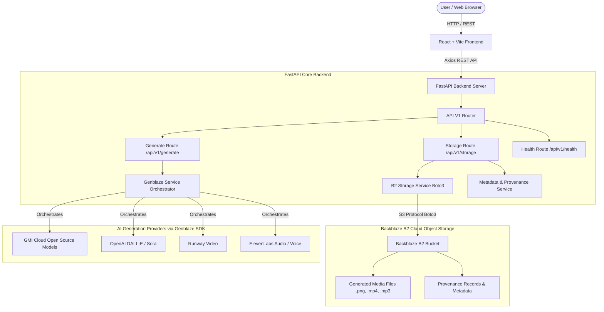

# 📐 GenMedia App - Architecture Specification

> **Backblaze GenAI Media Hackathon Blueprint**

---

## 🔮 System Overview

The **GenMedia App** architecture connects user prompt inputs with generative AI providers and durable cloud storage on Backblaze B2.

---

## 🛠️ Key Architectural Components

### 1. Frontend (React 18 + Vite)
- **State & Theme**: Dynamic light/dark theme switching stored in `localStorage` and managed via `ThemeContext`.
- **API Client**: Centralized Axios client (`services/api.js`) with request interceptors for base URL mapping, timeout handling, and unified error parsing.
- **Routing**: React Router DOM v6 managing navigation between `/` (Home), `/generate` (Studio), `/gallery` (Media Vault), and `/settings` (Configuration).

### 2. Backend (FastAPI + Pydantic v2)
- **Modular Routers**: Seperate endpoints for media generation, object storage, and health telemetry.
- **Data Validation**: Strict Pydantic models ensuring type safety across requests and responses.
- **Structured Logging**: Standardized JSON-capable logging module tracking API requests, task lifetimes, and error tracebacks.

### 3. Generative Orchestration (Genblaze SDK)
- **Unified Multi-Provider Interface**: Encapsulates model interactions across GMI Cloud, OpenAI, Runway, ElevenLabs, and Stability Audio.
- **Async Execution & Polling**: Task-based status monitoring for long-running video and image synthesis pipelines.

### 4. Durable Storage & Provenance (Backblaze B2)
- **S3 API Compatibility**: Utilizes `boto3` to communicate with Backblaze B2 S3 endpoints.
- **Media Asset Persistence**: Uploads generated images, video clips, and audio tracks directly to B2 buckets.
- **Provenance Tracking**: Preserves metadata (prompts, random seeds, provider version, timestamp, author) alongside assets in B2 for complete generation auditability.
